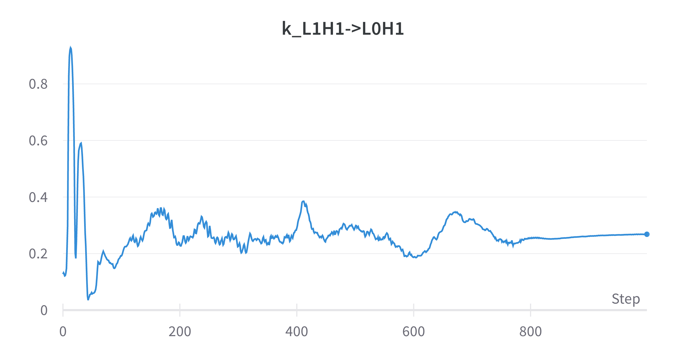

## Induction Heads

I was recently working on a project to try to understand how induction heads form in transformers. This is almost entirely derived from the work in [A Mathematical Framework for Transformer Circuits](https://transformer-circuits.pub/2021/framework/index.html) and its sequel [In-context Learning and Induction Heads](https://transformer-circuits.pub/2022/in-context-learning-and-induction-heads/index.html). As a quick recap, induction heads are heads that look for a previous example of the current token, then copy the following token. This allows the model to repeat arbitrary sequences of tokens. A simple way to form this head is as a two-head circuit split across two layers. The head in layer 1 attends to the previous token and copies the value of the current token. The head in layer 2 composes with the head in layer 1 to attend to the previous instance of the current token, and copy the relevant output (the next token). It turns out that this form of induction circuit is also the kind that seems to be quickest to form in the toy models I've played with as well.

## Measuring Composition

A good portion of _A Mathematical Framework_ is devoted to investigating how this composition happens. It describes three kinds of composition, Q-Composition, K-Composition, and V-Composition, when $W_Q$, $W_K$, and $W_V$ respectively read in a subspace affected by a previous head. It goes on to describe a way of measuring the amount of composition. For Q-Composition the measure they choose is

TODO: What's broken about this denominator??
$$ \frac{{||W_{QK}^{h_2T} W_{OV}^{h_1} ||}_F}{ {||W||}_F } $$

K- and V-composition have similar structures, with correspondingly different matrices. But all are of the form:

$$ \frac{{||AB||}_F}{{||A||}_F{||B||}_F}$$

where ${||A||}_F$ is the Frobenius norm. The intent of this measure is to capture the amount that $A$ reads in information from the output of $B$.

## Scores in Practice

In an already-trained model, looking at the relative composition scores of heads does a reasonable job of explaining which heads are composing with which. In a few toy models I saw induction heads have K-composition scores of around 0.2-0.3 with their previous-token head, while non-composed heads had scores under 0.1. The paper suggests subtracting off the amount of composition expected in two random matrices, which in these models were about 0.1. This spread is large enough to be able to visualize composition patterns easily in a heatmap.

This is already a bit unsatisfying to me, though. I really want heads whose only job is induction to have a composition score of 1! I put that aside for a bit though because I was especially interested in seeing how the K-composition evolved during training while the induction head formed. It would be very satisfying to see a bunch of near-zero K-composition until around when induction heads form, then a bump up to its final value.

This is where I started going a bit nuts trying to understand things. Because when I plotted this graph, I got

What??

For context, induction heads form between steps 700-800 in this training run.

OK, so it's somewhat unsatisfying if induction heads don't have K-composition scores near one. It's much more unsatisfying if they don't have scores near one _and_ random stuff that happens early on in training _does_ get a score of one.

So I started trying to understand this measure a bit better.

## Properties of this Measure

The Frobenius norm is sub-multiplicative, so this measure will take on values from zero to one. That feels good and proper. Great start.

Next, what does it mean to "read/write to the same space"? My intuition is that surely whatever we mean, the identity matrix reads and writes to the same space, and more generally, $A$ and $A^{-1}$ do.

Nope! For a $d$-dimensional identity matrix, ${||I||}_F = \sqrt{d}$, and ${||II||}_F = {||I||}_F$, so this measure comes out to $d^{-\frac{1}{2}}$. Extra gross! This thing isn't even dimension-invariant!

So how do you even get this thing to one then? This measures one when $A$ is a rank-1 matrix of constant rows, and $B$ is a rank-1 matrix of constant columns.

By the way, other matrix norms _do_ have the property that this measure will come out to one for the identity matrix, but they seem to all have other weird properties, like only measuring the maximum direction in which the two matrices are operating.

## Interpretation

My real motivation for writing this is to bait someone who is much better at linear algebra than me to think about this and explain what feels funny. In the interest of such baiting, I'll now attempt to badly explain what it feels like is going on. Your job is to get mad at how ignorant this explanation is and then [tweet at me](https://twitter.com/aslvrstn).

It seems like the fundamental disconnect is that we want to be measuring the amount that $B$ _can_ write into an arbitrary space for $A$ to read, but presently we're measuring the amount that $B$ _has to_ write into $every$ space for $A$ to read. So two orthonormal bases can compose with each other in arbitrary subspaces, but two rank-1 matrices have no choice but do so.

Is that maddening enough? I hope so! Please come hurl abuse my way as long as it has math in it.
