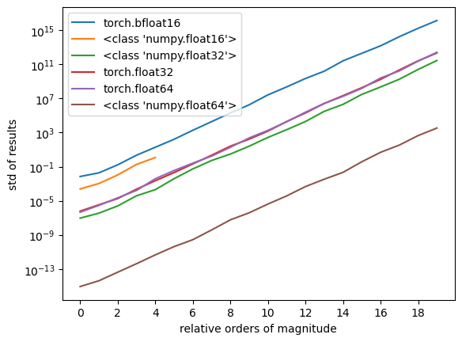

I was talking to [Neel Nanda](https://twitter.com/NeelNanda5) the other day and he (I think!) claimed that there seems to exist some sort of regularization such that transformers favor the standard basis for features. I wondered whether this might be due to floating point roundoff when features are of very different magnitudes. As he does, he ran off and had an experiment rigged up like thirty minutes later showing that it's plausible. I reproduced his experiment to try to clear up some confusions around this, but it does in fact seem like a plausible story and I wonder if this is just generally known and I'm late to the party.

Here's the setup: Generate a $d$-long feature vector $\vec{v}$ of all ones, except with the first value as $k$ orders of magnitude larger than the rest, e.g. $[1e8, 1, 1, 1]$. Generate a random $d \times d$ rotation matrix, $\mathbf{R}$. Rotate $\vec{v}$ by $\mathbf{R}$ and then back by $\mathbf{R}^\intercal$. We should recover $\vec{v}$, but in practice we'll see some changes to the small values due to floating point roundoff when the small features get mushed together into being co-represented by the same floating point value as the large features.

Here's a plot of what that looks like when using various floating point types:

If this is right, we hit 1% error on a ``bfloat16`` when the features span only a single order of magnitude! Here's a table of the orders of magnitude before hitting 1% error for various types:

| fp type | OOM |
| ------- | --- |
| t.bfloat16 | 1 |
| np.float16 | 3 |
| t.float32 | 5 |
| t.float64 | 5 |
| np.float32 | 6 |
| np.float64 | 14 |

